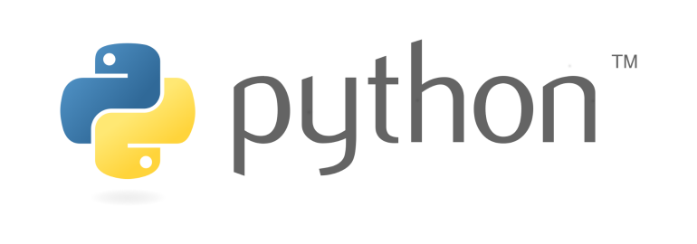

# Linkorn Meetups

Митапы проходят в офисе Линкорна по пятницам 2 раза в месяц. Докладчики - сотрудники компании и приглашенные специалисты.

Наша [телеграм группа](https://t.me/linkornmeetups).

Предложения по будущим темам вносятся в Issues.

## Будущие митапы

* 21.07.2017 Секреты языка Python

## Прошедшие митапы

* [Религии мира: Христианство](07-07-2017/README.md)
* [Жизнь в Америке](07-06-2017/README.md)
* [Введение в Arduino](26-05-2017/README.md)
* [React, Redux, dva.js](15-05-2017/README.md)
* [Git - tips and tricks](28-04-2017/README.md)
* [Golang](14-04-2017/README.md)
